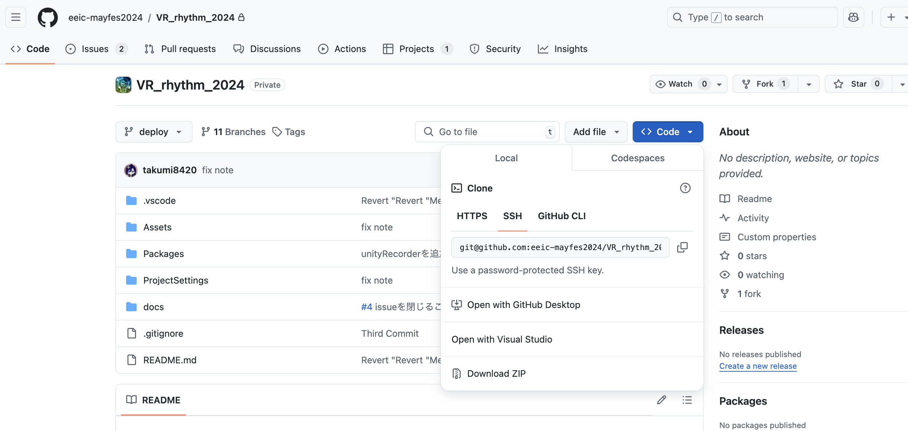

# Git/GitHubの開発フロー

## 一番最初にやること

### Gitのインストール


### リポジトリのクローン
`$ git clone <リポジトリのURL>`
で、リポジトリをクローンします。
リポジトリのURLは、`<> Code`と書かれたボタンをクリックすると表示されます。


`HTTPS`, `SSH`, `GitHub CLI`のタブがありますが、
`SSH`のタブを選択して、URLをコピーしてください。

もし、cloneがうまくいかない場合は、`HTTPS`からURLをコピーしてください。

> **Note**  
> sshとhttpsの違いは、githubにアクセスする際の認証方法です。
> ssh接続が推奨されているので、できるだけssh接続を使うようにしましょう。  
> 設定方法: https://qiita.com/shizuma/items/2b2f873a0034839e47ce

## 必要に応じてやること

## 0. (任意) Issueを作成する
GitHubのリポジトリでIssueを作成します。


issueを活用することで、誰がどの実装を担当しているのか把握しやすくなります。  
バグや改善点を見つけたけど、すぐに自分で取り掛かるのは難しい、どうすれば解決できるかわからない、...という時にも、
issueを書いておくことで、他のメンバーに作業を任せるのが楽になります。  
issueを立てると自動で番号が振られます。これをissue番号と呼びます。


## 1. 新しく作業を始める時にやること

githubのサーバー上にあるファイル群を**リモート**リポジトリ、自分のPC上にあるファイル群を**ローカル**リポジトリと呼びます。
以下、リモートはgithub、ローカルは自分のPCという意味で使います。

### 1.1. リポジトリを最新の状態にする

ローカルリポジトリのmainブランチに移動して、リモートの最新の状態をpullします。  
`$ git switch main`(mainブランチに移動)   
`$ git pull`(最新の状態にする)  
これによって、リモートリポジトリの最新のmainブランチの状態を、ローカルリポジトリに反映させます。

### 1.2. ブランチを作成する
`$ git switch -c <ブランチ名>`  
で新しいブランチを作成します。
git switchはブランチを切り替えるコマンドで、-cオプション(create)をつけると新しいブランチを作成してから切り替えることができます。
ブランチ名の付け方は、例えば、  
`$ git switch -c feat/<Issue番号>/<Issueの内容>`  
(新しい機能の実装)や、  
`$ git switch -c fix/<Issue番号>/<Issueの内容>`  
(バグの修正)などの付け方があります。  
Issue番号をつけず、  
`git switch -c feat/<issueの内容>`  
などでも構いません。

ブランチ名は半角の英数字と記号で書きましょう。
作業内容が伝わって、尚且つ他の人と被らない名前であればなんでもOKです。

作業をする時には、このブランチの中で作業を行なってください。  
なるべくmainブランチに直接コミットしないようにしましょう。
mainブランチを直接編集するのではなく、各々の作業ブランチで作業を行い、作業が完了したらmainブランチ取り込む(マージする)、という方法で更新します。
これにより、mainブランチを常に安定した状態(重大なバグが存在しない)に保つことができ、別の作業を始める時にも安心です。

また、ローカルリポジトリの一覧を表示したり、自分が今いるブランチを確認するには、
`$ git branch`
コマンドを使います。
`*`がついているブランチが今いるブランチです。

例.
```
$ git branch
* main
  feat/1/start-scene
  feat/2/choose-song-scene
```

> **Note**  
> gitについて調べると、ブランチの切り替えに`git checkout`というコマンドを使うサイトをたまに見かけますが、
> `git switch`コマンドはその後継にあたります。
> checkoutコマンドの機能が増えすぎたため、分かりやすくするために新しいコマンドが作られました。  
> とりあえず、`git switch`を使えば良いのではと考えています。

## 2. 翌日以降に作業を再開する時にやること

### 2.1. リポジトリを最新の状態にする
mainブランチに移動して、最新の状態にします。  
`$ git switch main`  
`$ git pull`  
次に、自分の作業ブランチに移動します。  
`$ git switch <ブランチ名>`  
そして、mainブランチの最新の状態を自分の作業ブランチに反映させます。  
`$ git merge main`

## 3. 作業しながらやること

作業をしながら、キリの良いところでコミットを行ってください。  
新しい関数を実装、見た目を変えた、などの単位でコミットを行うと良いです。
また、プログラムが動作する状態でコミットをすることが大切です。  
動かなくなった時に直前のコミットに戻ることで、動いている状態から作業を再開できるからです。

### 3.1. 変更の確認
`$ git status`
で、変更されたファイルを確認できます。

### 3.2. 変更をステージする
コミットの準備です。  
`$ git add <ファイル名>`
で、変更したファイルをステージします。  
`$ git add .`で、全ての変更をステージすることもできます。  
この時にステージしたファイルだけが、コミットの対象になります。

### 3.3. コミットする
`$ git commit -m "<コミットメッセージ>"`
で、コミットします。
コミットメッセージは変更内容が分かるように書きましょう。  
日本語でも英語でも大丈夫です。  
この時、  
`$ git commit -m "#3 <コミットメッセージ>"`
のように、Issue番号をcommitメッセージの先頭につけると、GitHub上でcommitとIssueが紐付けられて便利です。

### 3.4. リモートリポジトリにプッシュする
初めてプッシュする時は、  
`$ git push -u origin <ブランチ名>`  
を実行してください。リモートリポジトリにブランチが作成されます。

次回以降は、
`$ git push`
だけでリモートリポジトリにプッシュできます。

## 4. 作業の完了後
作業を完了して、変更点のpushも終わったら、GitHub上でプルリクエストを作成します。

### 4.1. プルリクエストを作成する
GitHub上で、プルリクエストを作成します。


レビュワーのレビューを待ちましょう。

### 4.2. (レビューが終わったら)mainブランチにマージ
プルリクエストが承認されたら、mainブランチにマージします。  
reviewerの人がやってしまってよいと思います。

### 4.3. リモートの作業ブランチを削除
プルリクエストが承認されたら、リモートの作業ブランチを削除します。  
<!-- `$ git push origin --delete <ブランチ名>`   -->
github上で削除するのが簡単です。
PRのマージ後に、`Delete branch`とかかれたボタンが表示されるので、それをクリックしてください。

### 4.4. ローカルの作業ブランチを削除
リモートのmainブランチの変更点をローカルに反映させます。  
`$ git switch main`  
`$ git pull origin main`  
そして、ローカルの作業ブランチも削除します。  
`$ git branch -d <ブランチ名>`  
(dはdeleteのdです。)

### 4.5. (もしあれば)対応するIssueを閉じる
github上で、対応するIssueを閉じます(closeする)。


## 5. おわり
以上です。お疲れ様でした。

細かいことをたくさん書いていますが、結局慣れることが一番重要なので
どんどんさわるのがいいと思います。
mainブランチさえ綺麗な状態で残しておけば、各ブランチでやらかしてもなんとかなります。

うまくいかないことがあれば、エラーメッセージなどでググれば大抵のことは解決できます。Slackで聞いていただいても大丈夫です！
